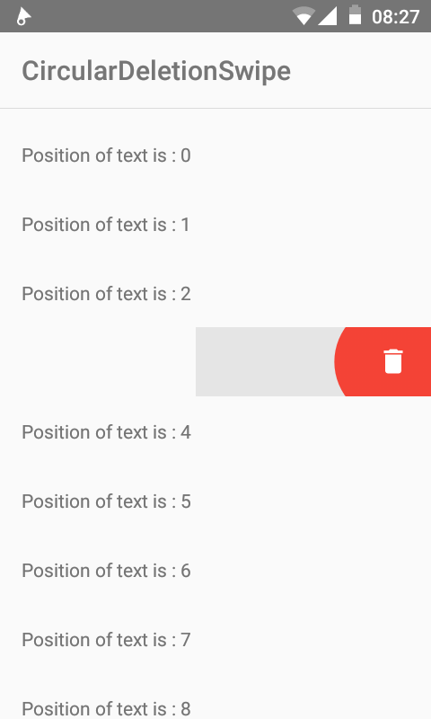

# CircularDeletionSwipe



### Description
This project implements one of the most beautiful animations of the class `RecyclerView`, the class `ItemTouchHelper`.

The `ItemTouchHelper` class implements the dragging of each object on the `RecyclerView` class by revealing a view under the first sliding view.

Please, refer to this link to learn more about the class [ItemTouchHelper](https://developer.android.com/reference/android/support/v7/widget/helper/ItemTouchHelper.html).

This project shows you not only how to implement this animation but also to add a circular animation that will coordinate with the sliding of your finger.

# Use
### First 
Copy the `DeletionSwipeHelper` java file to your project

### Secondly
Implemented the interface of the `DeletionSwipeHelper` class to include a sliding listener

```gradle
public class MainActivity extends AppCompatActivity implements DeletionSwipeHelper.OnSwipeListener
```

Then implement the onSwiped abstract methods

### Thirdly 
Note this import import android.support.v7.widget.helper.ItemTouchHelper;

### Fourth
Note these lines of programming in the `onCreate` method to initiate the |DeletionSwipeHelper` class

```gradle
ItemTouchHelper.Callback callback = new DeletionSwipeHelper(0, ItemTouchHelper.START, this, this);
ItemTouchHelper itemTouchHelper = new ItemTouchHelper(callback);
itemTouchHelper.attachToRecyclerView(recycler);
```

# Example of use
* Look at an example of use [MainActivity.java](https://github.com/MSay2/CircularDeletionSwipe/blob/master/app/src/main/java/com/msay2/circular_deletion_swipe/activities/MainActivity.java)
* Download the application for look the finaly result [CircularDeletionSwipe.apk](https://raw.githubusercontent.com/MSay2/CircularDeletionSwipe/master/sample%20apk/CircularDeletionSwipe.apk)


# Clone Git Repository
Please refresh build

# License

```
Copyright 2017 MSay2

Licensed under the Apache License, Version 2.0 (the "License");
you may not use this file except in compliance with the License.
You may obtain a copy of the License at

    http://www.apache.org/licenses/LICENSE-2.0

Unless required by applicable law or agreed to in writing, software
distributed under the License is distributed on an "AS IS" BASIS,
WITHOUT WARRANTIES OR CONDITIONS OF ANY KIND, either express or implied.
See the License for the specific language governing permissions and
limitations under the License.
```
